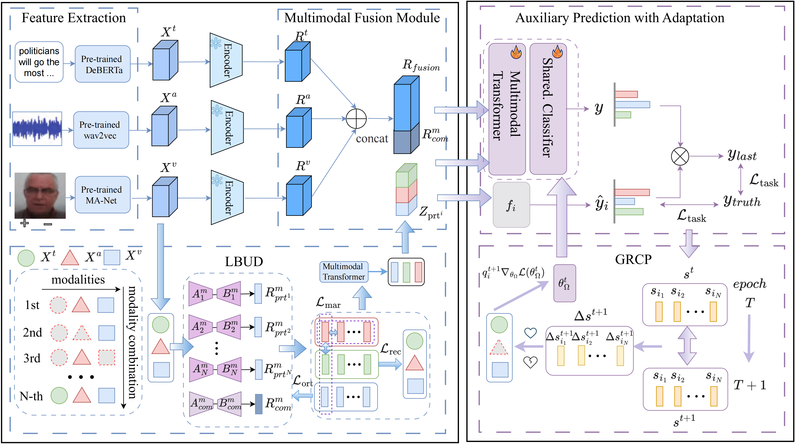

# MoMKE

Correspondence to: 
  - Jinsong Shu

## Paper

[**A Robust Incomplete Multimodal Low-Rank Adaptation Approach for Emotion
Recognition**]

## Usage

### Prerequisites
- Python 3.8
- CUDA 11.6
- pytorch ==1.12.0
- torchvision == 0.13.0
- numpy == 1.24.3

(see requirements.txt for more details)

### Dataset

To ensure consistency with previous work, we followed the feature preprocessing module in [MoMKE](https://github.com/wxxv/MoMKE).

For your convenience, we list the feature links below they provide.

|  Dataset  |                          Task                          |                        Download link                         |
| :-------: | :----------------------------------------------------------: | :----------------------------------------------------------: |
|  IEMOCAP  |         Emotion Recognition       | [link](https://drive.google.com/file/d/1Hn82-ZD0CNqXQtImd982YHHi-3gIX2G3/view?usp=share_link)|
|  CMU-MOSI |          Sentiment Analysis        | [link](https://drive.google.com/file/d/1aJxArYfZsA-uLC0sOwIkjl_0ZWxiyPxj/view?usp=share_link)|
|  CMU-MOSEI|          Sentiment Analysis       | [link](https://drive.google.com/file/d/1L6oDbtpFW2C4MwL5TQsEflY1WHjtv7L5/view?usp=share_link)|

### Run MCULoRA

~~~~shell
cd MoMKE
sh run_MCULoRA_cmumosei.sh

sh run_MCULoRA_cmumosi.sh

sh run_MCULoRA_iemocap4.sh
~~~~
